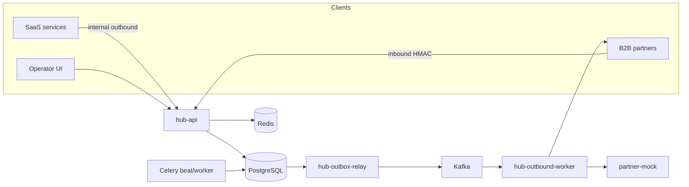

# Partner Integration Hub

Centralized B2B webhook delivery: at-least-once HTTP to partners, Kafka retry topics, dead-letter queue, audited replay, HMAC-SHA256, and SLA **measurement** (the hub does not compute contract penalties).

Product source of truth: [`spec.md`](spec.md) **v3.1 EN**. Agent rules: [`AGENTS.md`](AGENTS.md).

    

**Stack:** Python 3.12 · FastAPI · async SQLAlchemy · PostgreSQL 16 · Redis 8 · Kafka 4.3 (KRaft) · aiokafka · Celery (maintenance only) · Vite+React operator UI · OpenTelemetry → Prometheus + Jaeger · uv · pytest · Docker Compose.

Compose project and default network: **`b2b-partner-integration-hub`** (Make always passes `-p`; no system/container prune — image prune is project-labeled). Named volume: `b2b-partner-integration-hub-postgres-data`. Credentials live in a gitignored env file (tracked template: `.env.example`).

## Architecture

See [`docs/architecture.md`](docs/architecture.md) for C4, production Kafka RF=3 vs Compose RF=1, and the optional PostgreSQL read replica.



**Boundary:** HTTP accept does not POST to partners. The outbound worker owns webhook delivery. Celery is scheduled maintenance only (not retry transport).

**Dual-write mitigation:** persist writes the delivery (or inbound event) and `outbox_events` in one PostgreSQL transaction. `hub-outbox-relay` publishes to Kafka and sets `published_at`.

**Identifiers:** dual-id only on `partners` and `deliveries` — wire format is UUIDv7 `public_id`. Sequential integers never appear in API, UI, or Kafka payloads.

## Quickstart

```bash
cp .env.example .env
# Generate FERNET_KEY if you are not using the labeled demo placeholder:
# python -c "from cryptography.fernet import Fernet; print(Fernet.generate_key().decode())"
make compose-up
make seed && make seed-prod-like
```

Admin API calls in scripts and the operator UI expect a bearer token from the `ADMIN_BOOTSTRAP_TOKEN` env var (name only — set the value in your local `.env` from `.env.example`; do not commit it).

`hub-migrate` runs `alembic upgrade head` before API, relay, workers, and Celery start. Host-side `make migrate` remains available when you run the API on the host.

**Compose notes:** frozen host ports are listed in [`AGENTS.md`](AGENTS.md) §1.1 (hub-api 8000, admin-ui 8080, postgres 5432, redis 6379, kafka 9092, OTLP 4317/4318, prometheus 9090, grafana 3000, jaeger 16686, partner-mock 8090). `kafka-init`, `otel-collector`, `prometheus`, and `grafana` bake their configs into image builds (no host `./infra` bind mounts). `admin_ui/.dockerignore` excludes `node_modules` from the Admin UI build context.

| Surface | URL |
|---------|-----|
| HTTP contract (Swagger) | http://127.0.0.1:8000/docs |
| Operator UI | http://127.0.0.1:8080/ |
| Grafana (demo login from env template) | http://127.0.0.1:3000/ |
| Jaeger | http://127.0.0.1:16686/ |
| Partner mock | http://127.0.0.1:8090/ |
| Kafka UI (Kafbat) | http://127.0.0.1:8081/ |
| Redis Commander | http://127.0.0.1:8082/ |
| Adminer (Postgres, server `postgres`) | http://127.0.0.1:8083/ |
| Flower (Celery) | http://127.0.0.1:8084/ |

```bash
make ci                  # ruff, mypy, unit + contract — same as GitHub Actions
make asyncapi-validate   # AsyncAPI CLI validate (green; also GHA job `asyncapi`)
make test-e2e            # optional live smoke — pytest tests/e2e; skips if stack down
make stack-up            # full Compose stack (--build --wait); then make seed
make stack-down          # tear down (--remove-orphans; no -v)
```

**Load smoke (local, not CI):** with the full stack up and env exported in your shell (`set -a && source .env && set +a`), `make load-locust` runs a short Locust accept-path smoke (HTTP 202 on outbound ingest — not delivery SLA). k6 persist-path regression: `make load-k6`. See [`docs/runbooks/load-testing.md`](docs/runbooks/load-testing.md).

**CI scope:** GitHub Actions runs `make ci` plus a separate `asyncapi` job (`make asyncapi-validate`). Integration tests, e2e smoke, k6, and Locust are local gates (`make test-integration`, `make test-e2e`, `make load-k6`, `make load-locust`). `make test-e2e` is not part of `make ci`.

**Load evidence:** [`docs/perf/README.md`](docs/perf/README.md) (not a contractual SLA).
**Runbooks:** [`docs/runbooks/`](docs/runbooks/).
**SLO:** [`docs/slo.md`](docs/slo.md).

## Demo (~10 minutes)

Happy outbound, mock 503 → retry, mock 400 → DLQ, replay with reason, inbound bad HMAC → 403, duplicate `Idempotency-Key` → 200. Canonical slugs: `acme-erp`, `flaky-logistics`, `strict-payments`, `slow-crm`.

## Docs

| Doc | Role |
|-----|------|
| [`spec.md`](spec.md) | Product SoT (English requirements) |
| [`AGENTS.md`](AGENTS.md) | Agent entry |
| [`docs/architecture.md`](docs/architecture.md) | C4; Kafka RF=3 prod vs RF=1 Compose |
| Task↔spec ledger | Local SDD harness (gitignored) |
| [`docs/adr/`](docs/adr/) | Decisions |
| [`docs/runbooks/`](docs/runbooks/) | Ops runbooks |
| [`docs/perf/README.md`](docs/perf/README.md) | Load-test evidence |
| [`CONTRIBUTING.md`](CONTRIBUTING.md) | Local workflow |

The live OpenAPI document is `/docs`. The committed snapshot is only a pointer — [`docs/openapi/README.md`](docs/openapi/README.md).

## Stages

| Stage | Scope | Status |
|-------|--------|--------|
| **1** | Inbound+outbound, one retry tier, DLQ, audited replay, thin UI, OTel, OpenAPI, seed | In local codebase |
| **2** | Retry tiers, transactional outbox + relay, Redis CB, rate limits, Celery maintenance, secret rotation, compliance Grafana | In local codebase |
| **3** | Fan-out, JSON Schema registry, replay approval, partner status API, k6, Kafka `traceparent`, HA Kafka **docs** | In local codebase |

Do not treat this table as a release label. Evidence stays in the local working tree until the maintainer commits.
